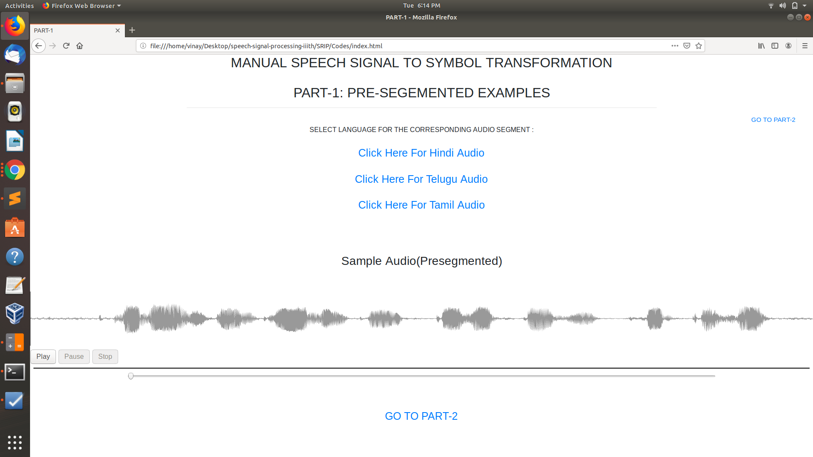
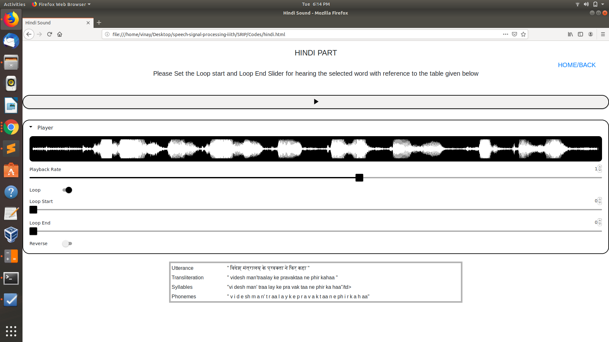
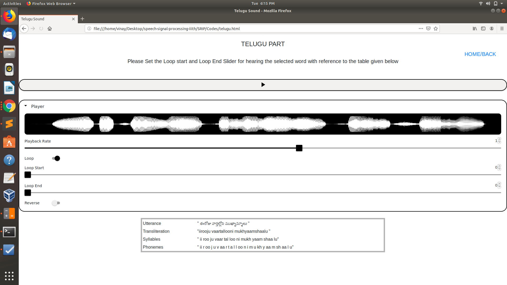
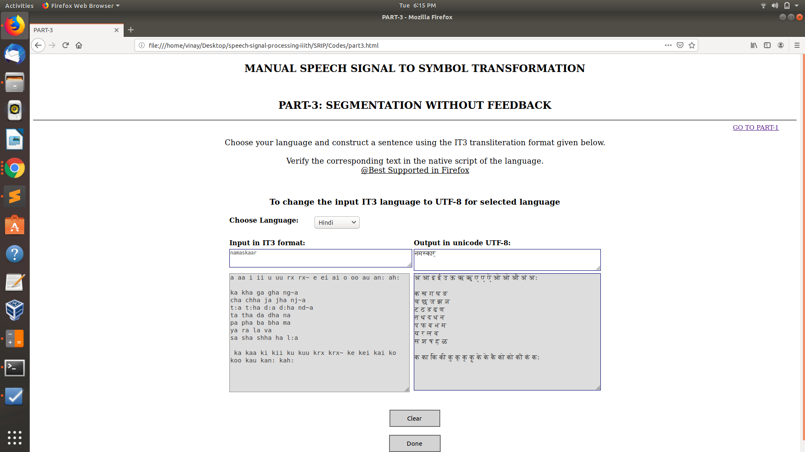

# Experiment Procedure Documentation
---
## Introduction
This document captures the instructions to run the simulation.

## Instructions
1. To start the experiment, open the "Index.html" file.

2. To run the experiment, open the corresponding file on FireFox named as Index.html in Codes folder .

3. Click on the Play button to hear a presegmented audio with its audio wave form.

4. After clicking on Link "click here for hindi audio" to hear the corresponding sound in hindi.

5. Use the tonggle to hear a segmented part of the audio with help of loop start and loop end slider.

6. Use the Back/home Link to navigate between pages.

7. After clicking on Link "click here for telugu audio" to hear the corresponding sound in telugu.

8. After clicking on Link "click here for tamil audio" to hear the corresponding sound in tamil.

9. Then navigate to Part-2 Link i.e To change the input IT3 language to UTF-8 for selected language.

10.The experiment overview is done.
  (the project is self explanatory).

