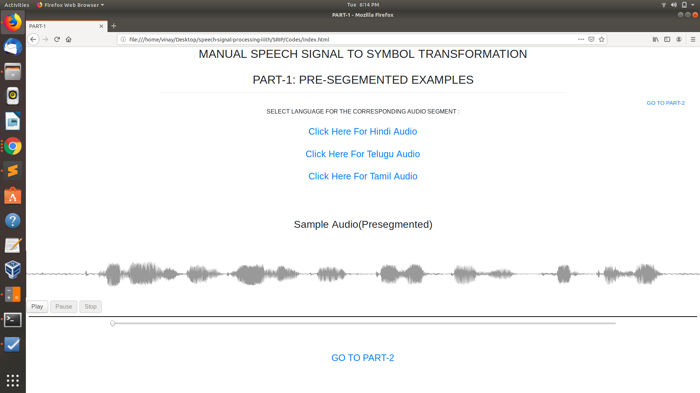
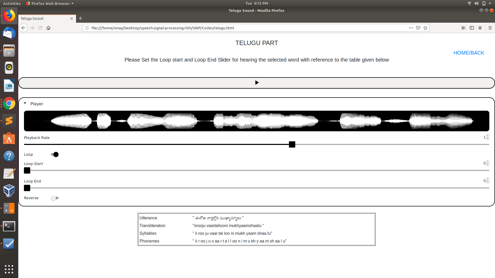

# Experiment Project Documentation
---
## Introduction
This  document captures the technical details related to the experiment development.

## Project
**Domain Name :** Computer Science & Engineering

**Lab Name :** Speech Signal Processing Lab

**Experiment Name :** Manual speech signal-to-symbol transformation

Manual speech signal-to-symbol transformation takes real-world signals like voice, audio, video, temperature, pressure, or position that have been digitized and then mathematically manipulate them. It helps the user to learn the syllable,Phoneme,Word of a pre-defined sentance and helps to comunicate it. 

## Purpose of the project
Objective of this experiment is to study learn the utterence of a perticular sentance differentating it separately with respect to its syllble ,Pheneme and word thereby helping the user to locate the wave and listen to the correspondingsond using the wavesurfer library. The second part of the lies in converting the input IT3 language to it's corresponding UTF-8.  

## Project Developers Details
| S.no | Names | Year of Study | Role | Email-ID | github handles |
| ---  |---    |---            |---   | ---      |  ---           |
| 1    | Vinay Teja.B | 2018-22 | Intern| vinayteja2000@gmail.com | vinaytejab |

## Technologies and Libraries
**Technologies :**
  1. HTML
  2. CSS
  3. Javascript

**Libraries :**
  1. Wavesurfer.js
  2. Bootstrap
  3. jQuery

## Development Environment
**OS :** Ubuntu 18.04 64-Bit

## Documents
| S.no | Link to Document | Role |
| ---  |---    |---            |
| 1. | Procedure | This document captures the instructions to run the simulations |
| 2. | Test Cases | This document captures the functional test cases of the experiment simulation |
| 3. | Code Documentation | This document captures the  details related to code |

## Process Followed to convert the experiment
1. Understand the assigned experiment functionality and simulation.
2. Understanding the experiment concept and requirement.
3. Re-implement it using javascript.

## Value Added by our Project
1. It would be beneficial for students studying Signal and Speech Processing have an easy interaction understanding using Wavesurfer.js library.

## Risks and Challenges
1. Creating the web page screen responsive and proper styling for various dimension screens.
2. Creating the transition features.
3. Understanding the installation of prerequisites.
4. Adding required functionalities.

# Experiment Procedure Documentation
---
## Introduction
This document captures the instructions to run the simulation.

## Instructions
1. To start the experiment, open the "Index.html" file.

2. To run the experiment, open the corresponding file on FireFox named as Index.html in Codes folder .

3. Click on the Play button to hear a presegmented audio with its audio wave form.

4. After clicking on Link "click here for hindi audio" to hear the corresponding sound in hindi.

5. Use the tonggle to hear a segmented part of the audio with help of loop start and loop end slider.

6. Use the Back/home Link to navigate between pages.

7. After clicking on Link "click here for telugu audio" to hear the corresponding sound in telugu.

8. After clicking on Link "click here for tamil audio" to hear the corresponding sound in tamil.

9. Then navigate to Part-2 Link i.e To change the input IT3 language to UTF-8 for selected language.

10.The experiment overview is done.
  (the project is self explanatory).
